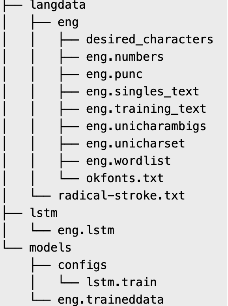

# OCR(ctpn + tesseract)

MacOS下配置tesseract
```bash
# install the latest version of tesseract for MacOS
brew install tesseract --head

# install pytesseract via pip
pip install pytesseract

# download language models from https://github.com/tesseract-ocr/tessdata
# Then move these models to /usr/local/share/tessdata/
chi_sim.traineddata (Simplified Chinese)
chi_tra.traineddata (Traditional Chinese)
```

MacOS下配置tesseract训练环境，其他环境参考[这里](https://tesseract-ocr.github.io/tessdoc/Compiling.html#macos)
```markdown
export HOMEBREW_NO_AUTO_UPDATE=true
brew install libtool automake
git clone https://gitee.com/vance-coder/tesseract.git
cd tesseract
./autogen.sh
./configure
make training
sudo make install training-install
```

**下面是针对tesseract4.1+使用lstm模型的fine tuning训练方式，以eng(英语)为例：**

1. 先提前下载训练所需材料
- 建立一个文件夹，用于承载所需材料，如：tesseract-train。
在下面操作中如果遇到没有的文件夹就自己建，这里不再一一赘述。
- 从[这里](https://github.com/tesseract-ocr/tessdata_best)下载eng.traineddata文件，
放到tesseract-train/models/下面（这是官方推荐的模型文件：Best (most accurate) trained LSTM models.）
- 从[这里](https://github.com/tesseract-ocr/tessconfigs/tree/3decf1c8252ba6dbeef0bf908f4b0aab7f18d113/configs)下载lstm.train文件，
放到tesseract-train/models/configs/下面（这是LSTM的配置文件）
- 从[这里](https://github.com/tesseract-ocr/langdata_lstm)下载eng文件夹下包括eng.training_text以及其他的所有文件，
放到tesseract-train/langdata_lstm/eng/下面（文件作用：Data used for LSTM model training）
- 从[这里](https://github.com/tesseract-ocr/langdata_lstm)找到并下载radical-stroke.txt文件，
放到tesseract-train/langdata_lstm/下面

2. 从原始eng模型(eng.traineddata)中提取lstm文件（lstm文件似乎就是训练权重）
```markdown
# eng.lstm就是提取出来的lstm文件，这里建立了一个lstm文件夹用来存放它
combine_tessdata -e ./model/eng.traineddata ./lstm/eng.lstm
```
执行完后，那么在tesseract-train目录下，应该会有以下文件


3. tesstrain工具生成训练集（Linux下应该都可以这么生成的，也可以用text2image）
- --fonts_dir /System/Library/Fonts 指定字体目录（不同系统目录不一样，自行百度）
- --fontlist "Heiti SC" 指定生产训练集使用的字体
- --lang eng 指定语言
- --linedata_only 指定生成的训练集是适合lstm训练的
- --save_box_tiff 同时保存box和tiff文件
- --noextract_font_properties
- --langdata_dir ./langdata_lstm 上面下载的语言材料包
- --maxpages 100 指定生成多少页训练数据
- --tessdata_dir ./models 指定模型
- --output_dir ./  指定生成的训练集输出目录
（还有更多参数请查看文档或者: tesstrain.sh --help）
```markdown
tesstrain.sh --fonts_dir /System/Library/Fonts --fontlist "Heiti SC"  --lang eng --linedata_only --save_box_tiff --noextract_font_properties --langdata_dir ./langdata_lstm --maxpages 100  --tessdata_dir ./models --output_dir ./
```
执行完后，那么在目录下，应该会生成以下文件


4. 开始训练(参数太多，不想一一解析了，只说关键的，因为这些都可以从文档找到，最底下有官方文档链接以及翻译版)
- --target_error_rate 0.05 指定目标错误率，我理解就是对本次训练集的识别的错误率
- --learning_rate 0.002  学习率，这应该就是梯度下降找最优解的那个学习率，默认只有0.001
- --model_output ./checkpoint/ 指定训练完成之后的模型输出，输出是checkpoint文件
- --continue_from ./lstm/eng.lstm 指定训练权重
- --traineddata ./models/eng.traineddata 指定现有的模型
- --train_listfile ./eng.training_files.txt 指定训练集（这个文件就是上面生成训练集的时候生成的文件之一）
- --max_iterations 10000 最大迭代次数，跑完一次测试集就算一次吧？（如果提前达到了target_error_rate，训练会提前结束）
```markdown
# 基于现有模型开始训练（fine tuning） 
lstmtraining --debug_interval 100 --max_image_MB 2000 --target_error_rate 0.05 --learning_rate 0.002 --model_output ./checkpoint/ --continue_from ./lstm/eng.lstm --traineddata ./models/eng.traineddata --train_listfile ./eng.training_files.txt --max_iterations 5000 > basetrain.log
# 基于上次训练开始继续训练（上次训练输出的是checkpoint，指向checkpoint即可）
lstmtraining --debug_interval 100 --max_image_MB 2000 --target_error_rate 0.02 --learning_rate 0.002 --model_output ./checkpoint/ --continue_from ./checkpoint/_0.091_244_3200.checkpoint --traineddata ./models/eng.traineddata --train_listfile ./eng.training_files.txt --max_iterations 8000 > basetrain.log
```
到此如果一切顺利的话，就会输出训练结果（checkpoint文件），下面就是将checkpoint文件转成tesseract可以使用的模型文件，
这里说一下，训练过程中有可能你的checkpoint文件会输出很多个，但一般来说你是要用错误率最低的那个checkpoint来合成模型，
如：_0.003_244_3200.checkpoint文件来说，0.003就是错误率。

5. 合并模型
- --continue_from ./checkpoint/_0.003_244_3200.checkpoint  指定我需要合并模型的checkpoint文件
- --traineddata ./models/eng.traineddata  指定现有的模型
```markdown
# 合并模型
lstmtraining --stop_training  --continue_from ./checkpoint/_0.003_244_3200.checkpoint --traineddata ./models/eng.traineddata  --model_output ./eng.traineddata
```


参考资料：

[Tesseract 4.0 LSTM训练超详细教程 - 知乎](https://zhuanlan.zhihu.com/p/58366201)

[tesseract训练教程 - 官方](https://tesseract-ocr.github.io/tessdoc/TrainingTesseract-4.00#training-text-requirements)

[tesseract训练教程翻译版 - CSDN](https://blog.csdn.net/panbiao1999/article/details/74638749)